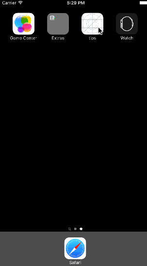

# Pre-work - *Tip-Calculator*

**The Tip-Calculator** is a tip calculator application for iOS.

Submitted by: **Jen Huynh**

Time spent: **15** hours spent in total

## User Stories

The following **required** functionality is complete:

* [X] User can enter a bill amount, choose a tip percentage, and see the tip and total values.
* [ ] Settings page to change the default tip percentage.

The following **optional** features are implemented:
* [ ] UI animations
* [ ] Remembering the bill amount across app restarts (if <10mins)
* [ ] Using locale-specific currency and currency thousands separators.
* [ ] Making sure the keyboard is always visible and the bill amount is always the first responder. This way the user doesn't have to tap anywhere to use this app. Just launch the app and start typing.

The following **additional** features are implemented:

- [ ] List anything else that you can get done to improve the app functionality!

## Video Walkthrough 

Here's a walkthrough of implemented user stories:

GIF created with [LiceCap](http://www.cockos.com/licecap/).

## Notes

Some challenges, I've had during the process of creating the app was discovering some code steps such as the var BillAmount with the Object C
code that was a bit troubling at first due to it seeing it as an error. But, after some research, the help of Katherine from CCSF 
comment to another student who had the same issue and asking, I was able to overcome part of it. The other solution came from reading out the 
error comments given by Xcode. It was due to the changes to the program that the video of creating a tip calculator that it did not change 
because it was made a few years before the changes of the var used a few years ago that was not done with the command let billAmount. Overall,
I learned even with challenges there's always a solution. It just requires patience, asking others, researching and what reading the comments 
from the program/software itself can help to solving and overcoming the challenges.

## License

    Copyright [2015] [Jen Huynh]

    Licensed under the Apache License, Version 2.0 (the "License");
    you may not use this file except in compliance with the License.
    You may obtain a copy of the License at

        http://www.apache.org/licenses/LICENSE-2.0

    Unless required by applicable law or agreed to in writing, software
    distributed under the License is distributed on an "AS IS" BASIS,
    WITHOUT WARRANTIES OR CONDITIONS OF ANY KIND, either express or implied.
    See the License for the specific language governing permissions and
    limitations under the License.
